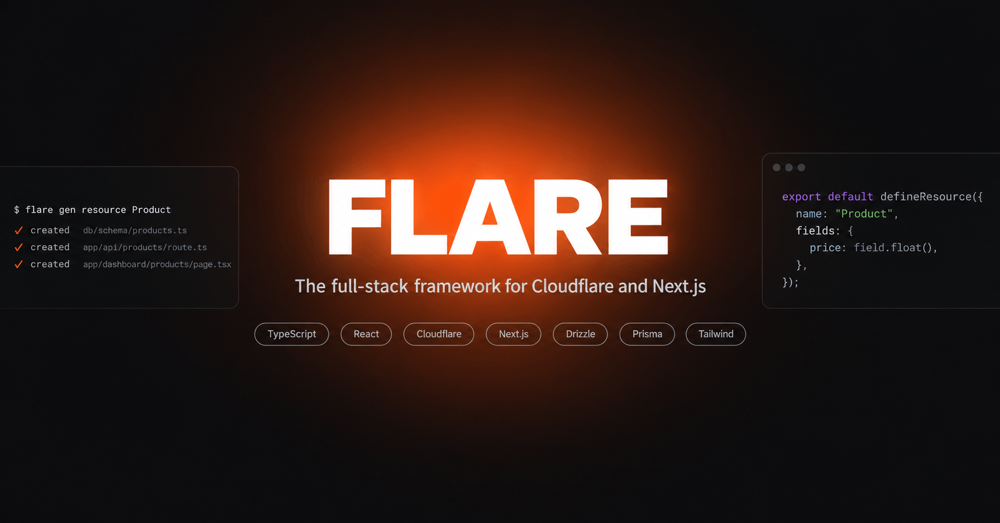

<p align="center">
  
</p>

<h1 align="center">Flare</h1>

<p align="center"><strong>Describe a resource once. Get the table, the API, the validation and the admin screens.</strong></p>

[](https://www.npmjs.com/package/@flaredev/cli)
[](https://github.com/MUKE-coder/flare-framework/actions/workflows/ci.yml)
[](./LICENSE)
[](https://flare-docs.codetotech.com)

```ts
// resources/product.resource.ts
export default defineResource({
  name: "Product",
  fields: {
    name: field.string(),
    sku: field.string({ unique: true }),
    price: field.float(),
    image: field.file({ accept: ["image"], required: false }),
    category: field.belongsTo("Category", { required: false }),
  },
});
```

```sh
npx flare gen resource Product
```

That writes the database table and its migration, Zod validators, a REST API
with cursor pagination and filtering, a typed fetch client, policy hooks, and
four dashboard pages — a sortable table with CSV import and export, a
multi-step form in a sheet, a record page, and loading skeletons shaped like
each of them.

## Two stacks, one descriptor

```sh
pnpm create flare-framework myapp                    # Cloudflare Workers
pnpm create flare-framework myapp -- --stack next    # Next.js on Vercel
```

| | **Cloudflare** (default) | **Next.js** |
| --- | --- | --- |
| Runtime | vinext on Workers | Next.js 16 on Vercel |
| Database | D1 (SQLite) | Neon (Postgres) |
| ORM | Drizzle | Prisma 7 |
| Cache | Workers KV | Upstash Redis |
| Files | R2 | R2 |
| Auth, email, payments | Better Auth · Resend · Stripe | the same |

Your descriptors, hooks, policies, seeds and every dashboard component are
identical on both. The schema, the migrations and the deploy are not.
[Compare them properly →](https://flare-docs.codetotech.com/start/stacks/)

## Nothing is hidden

The code that turns a descriptor into a working endpoint is **copied into
your app**, the way [shadcn/ui](https://ui.shadcn.com) copies a component
rather than shipping one from a package:

```
lib/resource/
  rows.ts          the contract a data source implements (~50 lines)
  query.ts         ?page, ?sort, ?q, ?filter[x], ?cursor → a parsed query
  store.ts         validation, hooks, computed values, pagination, errors
  handlers.ts      Request → Response, and the policy check
  drizzle-rows.ts  or prisma-rows.ts, depending on the stack
```

About 800 lines, in your repository, imported by every generated route.
Ctrl-click `createResourceHandlers` and you land in your own code — not in
`node_modules`. Change it, and `flare diff` will tell you how your copy
differs from the shipped one; `flare update --yes` takes the upstream
version, and refuses to run without being asked.

[Why it works this way →](https://flare-docs.codetotech.com/concepts/no-magic/)

## What comes with an app

Auth (passwords, magic links, email codes, passkeys, two-factor, social
sign-in), file uploads to R2, transactional email, Stripe subscriptions,
a policy layer, an OpenAPI document with a reference page, CSV import and
export, saved views, an audit log, six themes, a cost estimator, 404 and
error pages, and a cache that invalidates itself on writes.

## Install

```sh
pnpm create flare-framework myapp                                # recommended
npm create flare-framework@latest myapp                          # also fine
npm install -g @flaredev/cli                                     # global `flare`
curl -fsSL https://flare-docs.codetotech.com/install.sh | bash   # macOS / Linux
irm https://flare-docs.codetotech.com/install.ps1 | iex          # Windows
```

Node.js 22+. An app is around 340 packages, so dependencies install with
pnpm whenever it's on your machine — minutes under npm, seconds under pnpm.
`--pm npm` overrides that.

## Building with an AI agent

```sh
npx skills add MUKE-coder/flare-framework@flare
```

Gives a coding agent the CLI, the field grammar, the rules and the traps.
There's also [`/llms.txt`](https://flare-docs.codetotech.com/llms.txt) for
the docs index, and a **Build with AI** button on every docs page that
copies a full brief.

## This repository

A pnpm workspace:

| Path | Package | Role |
| --- | --- | --- |
| `packages/cli` | `@flaredev/cli` (bin: `flare`) | Every CLI verb, the field grammar, the code generators, and the app templates |
| `packages/core` | `@flaredev/core` | Descriptor and field types, validators, OpenAPI, formatting, fake data |
| `packages/create-flare-framework` | `create-flare-framework` | The `npm create` entry point |
| `skills/flare` | — | The agent skill, installable with `npx skills add` |
| `examples/demo` | — | A small CRM on the Cloudflare stack |
| `examples/shop` | — | The shop tutorial: stock and digital products, a till, a storefront |
| `examples/drive` | — | The drive tutorial: folders and multi-file upload |
| `examples/next-shop` | — | The Next.js stack against real Postgres, with ranked full-text search |
| `docs/` | — | The documentation site (Astro + Starlight) |

## Working on Flare itself

```sh
pnpm install
pnpm test          # builds every package, then the full vitest suite
pnpm typecheck
cd docs && npx astro dev    # the docs site on http://localhost:4321
```

Four files govern how this project is built, worth reading in order:

1. [`project-description.md`](./project-description.md) — the vision and the
   core technical decisions, especially the resource descriptor pattern and
   the codegen overwrite contract.
2. [`phases.md`](./phases.md) — the ordered build plan and the source of
   truth for progress.
3. [`style-guide.md`](./style-guide.md) — the visual system for the generated
   dashboard.
4. [`prompt.md`](./prompt.md) — how to pick up where a previous session left
   off.

## Documentation

[flare-docs.codetotech.com](https://flare-docs.codetotech.com) — source in
[`docs/src/content/docs/`](./docs/src/content/docs/).

Good places to start: the [quickstart](https://flare-docs.codetotech.com/start/quickstart/),
[choosing a stack](https://flare-docs.codetotech.com/start/stacks/),
[what it costs](https://flare-docs.codetotech.com/guides/costs/), and the
tutorials for [a shop](https://flare-docs.codetotech.com/tutorials/shop/) and
[a catalogue on Next.js](https://flare-docs.codetotech.com/tutorials/next-shop/).

## License

[MIT](./LICENSE)
